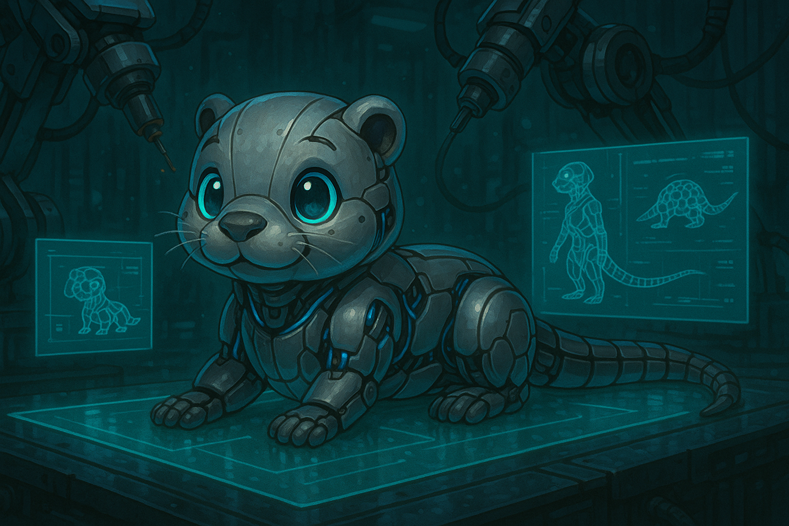

<div align="center">

# Agentic Programming Talk

[](https://python.org)
[](https://fastapi.tiangolo.com)
[](https://crewai.com)
[](LICENSE)

*A presentation about AI-assisted and agentic software development, with a live CrewAI demo.*



---

</div>

## Contents

### Presentation
- `presentation.md` - English version
- `presentation-german.md` - German version
- `theme-programmy.css` - Code editor style theme

### CrewAI Demo
- `crew_ai_python/` - Autonomous agent crew that builds a PixelPet web app

---

## Presentation Usage

```bash
./run.sh                        # English
./run.sh presentation-german.md # German
```

Requires [reveal-md](https://github.com/webpro/reveal-md) (auto-installed if missing).

---

## CrewAI Demo

The `crew_ai_python/` folder contains a multi-agent system that autonomously builds a Tamagotchi-style web application.

### Agents

| Agent | Role | Tools |
|-------|------|-------|
| **Architect** | Designs project structure | read_specs, list_files |
| **Implementer** | Writes the code | read/write files, list_files |
| **Tester** | Runs tests, fixes bugs | All tools + pytest, pip_install |

### Running the Demo

```bash
cd crew_ai_python
python -m venv .venv
source .venv/bin/activate
pip install -r requirements.txt

# Set your API key
export ANTHROPIC_API_KEY=your-key-here

# Run the crew
python crew.py
```

The crew iterates until tests pass and the app works. Progress is tracked in `STATUS.json`.

### Generated App

Once complete, run the PixelPet app:

```bash
cd crew_ai_python/workspace
uvicorn app.main:app --reload --port 1337
```

Open http://localhost:1337 to play.

### Documentation

- `SPECS.md` - Project requirements the agents follow
- `DEV_PROCESS.md` - How the agent iteration loop works

---

<div align="center">

**Author:** Franz Faul

</div>
