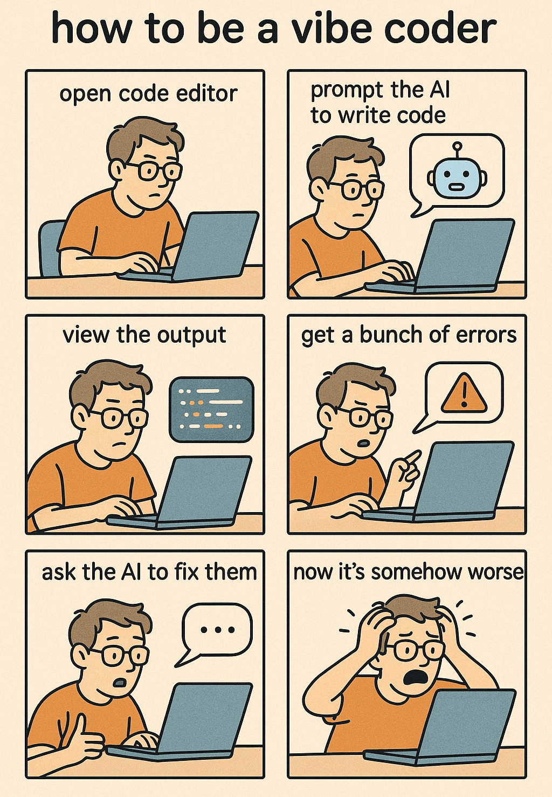
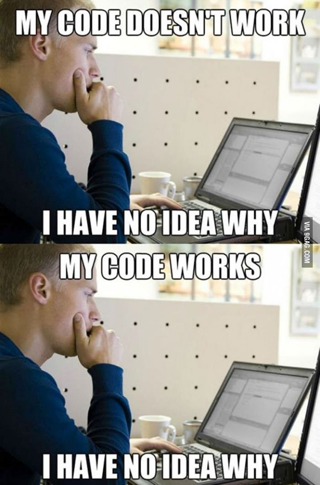

# **Vibe coding**
## Wenn Software beginnt, Software zu schreiben

*the good, the bad and the ugly*

Notes: Heute möchte ich über etwas sprechen, das viele „Vibe Coding“ nennen.
Für alle, die den Begriff noch nicht kennen: Gemeint ist Programmieren ausschließlich mit Hilfe von LLMs.

Wir nutzen LLMs heute bereits, um uns beim Programmieren zu unterstützen. Beim Vibe Coding geht man aber einen Schritt weiter – man überlässt der Maschine praktisch die gesamte Arbeit.

Die Meinungen dazu gehen stark auseinander. Manche finden es großartig, weil man in kurzer Zeit sehr komplexe Systeme bauen kann. Andere lehnen es komplett ab, weil man die kontroller verliert oder ds debugging sehr schwer sein kann.

---

## me.introduce()

- Franz Faul, ZKB, ehem ZHAWler
- Mache vieles mit AI-gestützter und agentischer Entwicklung
- Interessiert, wie sich Softwareentwicklung verändert
- https://github.com/fauli
---

## Einstiegsfrage

**Wie viele von euch nutzen bereits Agents beim Programmieren?**

- 🟩 Regelmässig (1)
- 🟨 Ein paar Mal (2)
- 🟥 Nie (3)

---



---

# Teil 1
## time.rewind()

---

## Von Lochkarten zu Prompts

Programmierung wird immer **abstrakter**:

- Maschinencode → Assembler
- C → Java → Frameworks
- Cloud → Container → DevOps
- AI-gestützte Programmierung

🧠 Jeder Schritt entfernt uns von Syntax hin zu Ideen.

Notes: Jeder Abstraktionssprung ist nicht entstanden, weil Computer ihn gebraucht hätten – sondern weil Menschen ihn gebraucht haben.

„Assembler hat Maschinencode nicht ersetzt, weil CPUs plötzlich keine Bits mehr verarbeiten konnten.
Er hat ihn ersetzt, weil Menschen nicht mehr über Tausende von Opcodes nachdenken konnten.“

„C entstand nicht, weil Maschinen Funktionen und Strukturen gebraucht hätten.
Es entstand, weil Menschen Namen, Grenzen und mentale Modelle brauchten.“

„Frameworks sind nicht entstanden, weil Computer sie verlangt haben.
Sie sind entstanden, weil die Komplexität von Software das überstiegen hat, was ein einzelnes Gehirn erfassen kann.“

Programmiersprachen sind Werkzeuge für das Denken – nicht Anweisungen für Maschinen.
...
„Sie prägen, wie wir denken, wie wir über Systeme nachdenken und wie wir zusammenarbeiten –
die Maschine ist am Ende nur der letzte Abnehmer.“

„Jede neue Abstraktionsebene hat uns näher daran gebracht, auszudrücken was wir wollen,
statt wie die Maschine es im Detail tun muss.“

„Das bedeutet nicht, dass Programmieren verschwindet –
es verschiebt sich auf eine höhere kognitive Ebene.“

---

## Die 3 Ären der Software (Karpathy)

| Ära | Beschreibung |
|------|------------|
| **Software 1.0** | Menschen schreiben Code |
| **Software 2.0** | Menschen trainieren Modelle (NNs = Code) |
| **Software 3.0** | Menschen schreiben *Ziele & Prompts* |

🔥 Heute befinden wir uns im Übergang von 2.0 → 3.0.

Notes: Software 1.0 — Menschen schreiben Regeln (sehr vertraut)
„Wenn die Temperatur über 30 Grad liegt, schalte den Ventilator ein.
Wenn sie unter 20 Grad fällt, schalte ihn aus.“

Software 2.0 — Menschen schreiben keine Regeln mehr, sie geben Beispiele
„Denkt zum Beispiel an Bilderkennung: Man schreibt keine Regeln wie
›Wenn Pixel X dunkler ist als Pixel Y …‹
Stattdessen zeigt man tausende Bilder und sagt: ›Das ist eine Katze. Das ist keine.‹“

Zentrale gedankliche Veränderung
„Das ‚Programm‘ steht nicht mehr im Code – es steckt in den Gewichten des Modells.“

Software 3.0 — Menschen beschreiben Ziele, Systeme erledigen den Rest
„Baue mir einen Service, der X macht, diese Randbedingungen einhält und über längere Zeit zuverlässig funktioniert.“

Wichtiger Merksatz (mehrmals wiederholen)
Intention statt Instruktionen.

Wichtige Einordnung
„Wir sind noch nicht vollständig in Software 3.0 angekommen.“

Zusammenfassung
Software 1.0 → wir schreiben Anweisungen
Software 2.0 → wir liefern Beispiele
Software 3.0 → wir beschreiben gewünschte Ergebnisse

Und genau an dieser Stelle kommen agentische Systeme ins Spiel –
denn sie sind der erste ernsthafte Versuch, Software wirklich auf Intentionen aufzubauen.

---

## Warum AI für Code?

Code ist:

- Strukturiert
- Repetitiv
- Öffentlich verfügbar (GitHub, Docs, StackOverflow)
- Hat Regeln und Muster

Perfektes Lernmaterial für grosse Sprachmodelle.

Notes: Grosse Sprachmodelle funktionieren überraschend gut beim Programmieren, weil Code klaren Regeln und Mustern folgt.

Im Gegensatz zur natürlichen Sprache hat Code meist eine eindeutige Struktur, eine konsistente Syntax und existiert in riesigen öffentlichen Repositories wie GitHub.

Das macht ihn zu idealem Trainingsmaterial.
---

## Zeitstrahl: Wie wir hierher kamen

- 2010–2018 → Deep Learning Boom
- 2020 → GPT-3: erstes grosses allgemeines Sprachmodell
- 2022 → ChatGPT verleiht Coding-Superkräfte
- 2023–2025 → Agentische AI erscheint (AutoGPT, Devin, CrewAI)

Notes: Die erste Welle moderner AI konzentrierte sich hauptsächlich auf Wahrnehmung — Systeme, die sehen und hören konnten.
Dazu gehören Bilderkennung, Objekterkennung und Speech-to-Text.
Diese Modelle waren sehr gut darin, die Frage „Was ist das?“ zu beantworten, aber nicht „Was soll ich damit tun?“.
Sie ersetzten menschliche Sinne, aber nicht menschliche Entscheidungsfindung.

Die zweite Welle verlagerte sich auf Sprachverständnis.
Modelle konnten Texte verarbeiten, klassifizieren, übersetzen, zusammenfassen und Fragen beantworten.
Das fühlte sich bereits intelligenter an, aber diese Systeme waren größtenteils reaktiv — sie reagierten auf Eingaben, planten jedoch nicht selbst und handelten nicht eigenständig.

Etwa ab 2022, mit Systemen wie ChatGPT, überschritten wir eine wichtige Schwelle: Modelle begannen, ein reasoning-ähnliches Verhalten zu zeigen.
Sie konnten mehrstufige Anweisungen befolgen, ihr Vorgehen erklären, Code schreiben und Wissen aus verschiedenen Bereichen kombinieren.
Das bedeutete nicht, dass sie wirklich „denken“, aber es machte sie nützlich für komplexe kognitive Aufgaben.

Erst ganz kürzlich erhielten Modelle die Fähigkeit, Werkzeuge zu nutzen und mit externen Umgebungen zu interagieren — etwa APIs aufzurufen, Code auszuführen, Dateien zu lesen oder den Zustand eines Systems zu beobachten.
Das ist der entscheidende Wandel, der agentische Workflows ermöglicht hat: AI-Systeme, die planen, handeln, Ergebnisse beobachten und ihr Verhalten über mehrere Schritte hinweg an ein Ziel anpassen.

---

# Teil 2
## LLMs & Coding-Assistenten

---

## Was ist ein LLM?

Ein Modell, das trainiert wurde, das **nächste Wort/Token vorherzusagen**.

Es lernt aus:

- Natürlicher Sprache
- Code-Repositories
- Dokumentation
- Mustern und Strukturen

⚙️ Kein menschliches Denken — aber mächtige Mustersynthese.

Notes: Ein grosses Sprachmodell ist im Kern eine Next-Token-Vorhersage im großen Massstab.
Es „denkt“ nicht wie ein Mensch, aber weil es auf riesigen Datensätzen trainiert wurde — einschlieslich Code — kann es Muster synthetisieren und Ergebnisse erzeugen, die intelligent wirken.

---

## Coding-Assistenten

Beispiele:

GitHub Copilot, ChatGPT, Cursor, Codeium

Sie können:

- Grundgerüste generieren
- Korrekturen vorschlagen
- Tests schreiben
- Unbekannten Code erklären

👉 Immer noch **reaktiv** — du fragst, es antwortet.

Notes: Coding-Assistenten wie Copilot oder ChatGPT sind im Grunde stark beschleunigte Autovervollständigung.
Sie helfen bei Syntax, Boilerplate-Code und beim Verstehen unbekannter APIs.
Sie sind unglaublich nützlich — aber sie sind immer noch darauf angewiesen, dass wir ihnen explizite Anweisungen geben.

---

## Der neue (alte) Workflow

Alter Weg:

```

Google → StackOverflow → kopieren/einfügen → debuggen → iterieren

```

Neuer Weg:

```

Absicht beschreiben → AI entwirft → Du prüfst → iterieren

```

Du wechselst vom **Code tippen** zum **über Code nachdenken**.

Notes: AI beginnt, den Entwickler-Workflow zu verändern.
Anstatt mit einer leeren Datei zu starten, beginnt man damit, Architektur, Verhalten oder Randbedingungen zu beschreiben — und lässt die AI den Code vorbereiten.
Die eigene Aufgabe verschiebt sich stärker hin zu Review, Verfeinerung und Nachdenken, statt Syntax zu tippen.

---

# Teil 3
## Von Assistenten zu Agenten

---

## Was ist ein AI-Agent?

> **Ein Agent ist ein AI-System, das ein Ziel autonom verfolgen kann, indem es Werkzeuge, Gedächtnis und Feedback-Schleifen nutzt.**

Im Gegensatz zu Assistenten können Agenten:

*Planen, Ausführen, Beobachten und bewerten, Iterieren*

Notes: Ein zentraler Wandel ist der Schritt von AI-Assistenten zu AI-Agenten.
Ein Assistent beantwortet Fragen. Ein Agent verfolgt ein Ziel.

Er kann Schritte planen, Werkzeuge ausführen, Ergebnisse überprüfen und iterieren — also deutlich näher an der Arbeitsweise eines "Junior Engineers".

Wichtig: Ein AI-Agent soll keinen Junior Engineer ersetzen.

Explain explicitly:

A junior engineer is trusted with:
- understanding context
- making judgment calls
- taking responsibility for outcomes

Then contrast:

An AI agent:
- does not understand business impact
- does not know when something ‘feels wrong’
- cannot be accountable

Fazit
- Verantwortung lässt sich nicht automatisieren.
- Echtes Verständnis von „Business Requirements“ lässt sich nicht automatisieren.
---

## Assistent vs Agent

| Merkmal | Assistent | Agent |
|--------|-----------|--------|
| Input | Prompt | Ziel |
| Verhalten | Eine Antwort | Mehrstufige Schleife |
| Gedächtnis | Kurz | Langzeit + kontextuell |
| Werkzeuge | Begrenzt | Kann Code, Tests, Browser, Repo ausführen |
| Autonomie | Niedrig | Mittel–Hoch |

---

## Let the vibin' begin!

1. 🎯 Ziel erhalten
2. 🧩 Schritte planen
3. 🛠️ Aktionen ausführen
4. 👀 Ergebnisse beobachten
5. 🔁 Reflektieren & anpassen
6. 🏁 Wiederholen bis fertig

Notes: 
Go to Claude Code.

Show flow with ChatGPT, then setup project. say how bad tests can be in default agent. You need to do "prompt expansion", as the words are predicted on the context, if it knows that good tests are, then it can write them better, s for that then add roles.
.......
This loop — plan, act, observe, refine — is what allows an agent to make persistent progress toward a goal, instead of just producing a single answer and stopping. It can try something, see what happened, adjust its approach, and continue — much closer to how humans actually work.

At the same time, this loop is also where things can go wrong. Agents can get stuck repeating the same steps, or confidently pursue strategies that are simply wrong. So the loop is powerful, but it’s not perfect — and that’s exactly why human oversight still matters.


---

## Anatomie eines Coding-Agenten

- 🧠 **LLM-Gehirn**
- 💾 **Gedächtnis** (Kontext + Vektorspeicher)
- 🧰 **Werkzeug-Schicht** (Dateisystem, CLI, Browser, APIs)
- 🗂️ **Orchestrierungs-Framework** (LangChain, CrewAI, ReAct)

Notes: Unter der Haube ist ein Agent nicht einfach nur ein Sprachmodell.
Das LLM ist wichtig, aber es ist nur ein Teil des Systems.

Darum herum gibt es eine Speicherkomponente, um Kontext und frühere Entscheidungen abzulegen, eine Reihe von Werkzeugen, die der Agent aufrufen kann, und eine Orchestrierungsschicht, die entscheidet, was als Nächstes passiert.

Insgesamt bedeutet das:
Ein Agent ist eigentlich ein Ökosystem, kein einzelnes Modell.

Die Intelligenz entsteht aus dem Zusammenspiel dieser Komponenten — nicht aus dem Modell allein.

---

# Teil 4
## Aktuelle Tools & Beispiele

---

## Ökosystem-Überblick (2025)

- CrewAI *(Multi-Agenten-Kollaboration)*
- AutoGPT / BabyAGI *(frühe Prototypen)*
- LangChain *(allgemeines Agenten-Framework)*
- OpenDevin / Devin *(autonome Softwareentwicklung)*

Der Bereich entwickelt sich *schnell.*

Note: Switch to CrewAI example!

---

## "AI-Software-Ingenieur" Beispiele

Fähigkeiten:

- Ein Repository verstehen
- Features planen
- Mehrere Dateien bearbeiten
- Tests ausführen
- Pull Requests erstellen

Erfordert immer noch menschliche Überprüfung!

---



---

# Teil 5
## 🥁 The ugly

---

## Wo Agenten scheitern

- Halluzinierte oder falsche Lösungen
- Sehr verboser code
- Ähnliche Lösungen an verschiedenen Orten
- Falsches Selbstvertrauen
- Mangelndes Domänenwissen
- Überanpassung an Muster statt echtem Denken

---

## Sicherheit & Zuverlässigkeit

- Sicherheitslücken
- Abhängigkeiten werden unbemerkt eingefügt
- Lizenz-Unklarheiten
- Unsichere Muster werden blind kopiert

🛑 Vertrauen — aber überprüfen.

---


---

## Mensch in der Schleife

Ihr seid weiterhin verantwortlich für:

- Architektur
- Code-Review
- Testing
- Produktionsqualität
- Ethik & Sicherheit

Agenten beschleunigen **Engineering** — sie ersetzen es nicht.

Notes:
„Schreib mir eine App, die X macht.“

Besser ist es, schrittweise vorzugehen:
zuerst Spezifikationen erstellen (zum Beispiel eine SPECS.md),
dann gezielt Agenten einsetzen —
aber nacheinander, nicht alles auf einmal,
und immer selbst im Loop bleiben.

Sag dem Modell ausserdem explizit, dass es nachschauen soll, wie Dinge heute umgesetzt werden, ggf. mit dem aktuellen Jahr.

---

# Teil 6
## Die Zukunft & Eure Rolle

---

## Was kommt als Nächstes?

- Repository-bewusste Agenten
- Kontinuierlich selbstwartende Codebasen
- Multi-Agenten-Teams (Architekt + Coder + Tester)
- "Vibe Coding" — beschreibe das *Gefühl*, nicht die Syntax
- Englisch als meist genutze Programmiersprache? 😜

Notes: „Deine IDE wird zum Teammitglied“

- Aufgaben schreiben, nicht Funktionen
- Feedback entwerfen, nicht Outputs
- Logs lesen statt Stacktraces
- Verhalten debuggen, nicht Syntax

„Man debuggt keinen Code mehr — man debuggt Intention.“
.....
Warum das für Junior Developers eigentlich grossartig ist

- Syntax ist weniger wichtig
- Denken ist wichtiger
- Systeme zu verstehen ist am wichtigsten

„AI ersetzt keine Junior Devs.
Sie ersetzt das Festhängen an Syntax.“

---

## Welche Fähigkeiten zählen jetzt?

- Problemlösung
- Systemdesign
- Code lesen und validieren
- Absichten klar kommunizieren
- Trade-offs & Architektur verstehen

AI schreibt schneller — aber *ihr* entscheidet, **was geschrieben werden soll.**

Notes:Die Zukunft des Programmierens besteht nicht darin, Computern exakt zu sagen, was sie tun sollen —
sondern Systeme zu lehren, wie sie Entscheidungen treffen und deinen Prozess unterstützen.

---

## Danke ✨

Happy coding!

Notes: 

ChatGPT:
Create me a PLAN.md file for my claude code project.
I want to to a TUI (text based UI) that allows me to config a source and destination folder in a config file (config.yaml).
The application should load the source folder structure and should allow me to select certain folders that will be synced (rsync style) to the destination folder.
It should show which ones are synced already and what is syncing right now.
I want to be able to start the sync when I want to, with the possibility of installing some sync daemon in the future.
There should also be a view for only synced, only not synced, and all.
It should never do anything with the source files!

—
Then:
I want to use python. Can you write this in an ARCHITECTURE.md file for my claude code project!

——
perfect. now based on best practices, can you write me the CLAUDE.md file?

—
Then I do in claude:
read the document at https://blog.sshh.io/p/how-i-use-every-claude-code-feature and tell me how to improve my Claude code setup

————
> for further development, can you create agent roles/personas under .vibe/roles for: TUI designer, implementor, reviewer, product owner. consider all these experts in their field with high quality standards and add the created roles to CLAUDE.md so I can refer to them "as X do Y"
