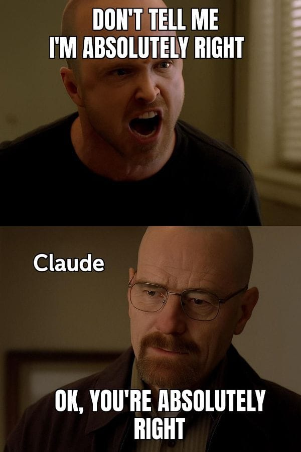

# **Vibe coding**
## Wenn Software beginnt, Software zu schreiben

*the good, the bad and the ugly*

Notes: Today I want to talk about what people call vibe coding. I.e. maybe those not aware of that, it's coding only using LLMs.
You can already use LLMs to support you in coding, but with vibe coding you let the machine do all of it.
There is a big difference in what people think of it. some like it (you can build a complex machine in 2 hours), some hate it.
---

## me.introduce()

- Franz Faul, ZKB, ehem ZHAWler
- Mache vieles mit KI-gestützter und agentischer Entwicklung
- Interessiert, wie sich Softwareentwicklung verändert
- https://github.com/fauli
---

## Einstiegsfrage

**Wie viele von euch nutzen bereits Agents beim Programmieren?**

- 🟩 Regelmässig (1)
- 🟨 Ein paar Mal (2)
- 🟥 Nie (3)

---

# Teil 1
## time.rewind()

---

## Von Lochkarten zu Prompts

Programmierung wird immer **abstrakter**:

- Maschinencode → Assembler
- C → Java → Frameworks
- Cloud → Container → DevOps
- KI-gestützte Programmierung

🧠 Jeder Schritt entfernt uns von Syntax hin zu Ideen.

Notes: Every abstraction shift wasn’t made because computers needed it — it was made because humans did.
“Assembly didn’t replace machine code because CPUs couldn’t handle bits anymore.
It replaced it because humans couldn’t reason about thousands of opcodes.”

“C didn’t exist because machines needed functions and structs.
It existed because humans needed names, boundaries, and mental models.”

“Frameworks didn’t appear because computers demanded them.
They appeared because software complexity exceeded what one brain could hold.”

Programming languages are tools for thought, not instructions for machines.

Then expand verbally:

“They shape how we think, how we reason about systems, how we collaborate —
the machine is just the final consumer.”“Every abstraction layer moved us closer to expressing what we want,
instead of how the machine must do it.”

“That doesn’t eliminate programming —
it moves programming to a higher cognitive level.”

---

## Die 3 Ären der Software (Karpathy)

| Ära | Beschreibung |
|------|------------|
| **Software 1.0** | Menschen schreiben Code |
| **Software 2.0** | Menschen trainieren Modelle (NNs = Code) |
| **Software 3.0** | Menschen schreiben *Ziele & Prompts* |

🔥 Heute befinden wir uns im Übergang von 2.0 → 3.0.

Notes: Software 1.0 — Humans write rules (very familiar)
“If the temperature is above 30 degrees, turn on the fan.
If it’s below 20, turn it off.”

Software 2.0 — Humans don’t write rules, they provide examples
“Think of image recognition:
You don’t write rules like
‘if pixel X is darker than pixel Y…’
You show thousands of images and say:
‘This is a cat. This is not.’”

Key mental shift:

“The ‘program’ is no longer written in code —
it’s stored in model weights.”

Software 3.0 — Humans describe outcomes, systems handle the rest
‘Build me a service that does X, follows these constraints, and keeps working over time.’”

Key phrase to repeat:

Intent instead of instructions.

!!!“We are not fully in Software 3.0 yet.”

“So:

Software 1.0 → we write instructions

Software 2.0 → we give examples

Software 3.0 → we describe outcomes”

---

## Warum KI für Code?

Code ist:

- Strukturiert
- Repetitiv
- Öffentlich verfügbar (GitHub, Docs, StackOverflow)
- Hat Regeln und Muster

Perfektes Lernmaterial für grosse Sprachmodelle.

Notes: "Large language models work surprisingly well for programming because code follows rules and patterns. Unlike natural language, most code has clear structure, consistent syntax, and exists in huge public repositories like GitHub. That makes it ideal training material."
---

## Zeitstrahl: Wie wir hierher kamen

- 2010–2018 → Deep Learning Boom
- 2020 → GPT-3: erstes grosses allgemeines Sprachmodell
- 2022 → ChatGPT verleiht Coding-Superkräfte
- 2023–2025 → Agentische KI erscheint (AutoGPT, Devin, CrewAI)

Notes: The first wave of modern AI focused mainly on perception — systems that could see and hear. This includes image recognition, object detection, and speech-to-text. These models were very good at answering “What is this?” but not “What should I do about it?” They replaced human senses, but not human decision-making.

The second wave moved into language understanding. Models could process text, classify it, translate it, summarize it, and answer questions. This already felt more intelligent, but these systems were still mostly reactive — they responded to input, but they didn’t plan or act on their own.

Around 2022, with systems like ChatGPT, we crossed an important threshold: models began to show reasoning-like behavior. They could follow multi-step instructions, explain their thinking, write code, and combine knowledge across domains. This didn’t mean they truly “think,” but it made them useful for complex cognitive tasks.

Only very recently did models gain the ability to use tools and interact with external environments — calling APIs, running code, reading files, or observing system state. This is the key shift that unlocked agentic workflows: AI systems that can plan, act, observe results, and adapt over multiple steps toward a goal.

---

# Teil 2
## LLMs & Coding-Assistenten

---

## Was ist ein LLM?

Ein Modell, das trainiert wurde, das **nächste Wort/Token vorherzusagen**.

Es lernt aus:

- Natürlicher Sprache
- Code-Repositories
- Dokumentation
- Mustern und Strukturen

⚙️ Kein menschliches Denken — aber mächtige Mustersynthese.

Notes: "A large language model is essentially next-token prediction at scale. It doesn’t ‘think’ like a human, but because it’s trained on huge datasets — including code — it can synthesize patterns and produce results that feel intelligent."

---

## Coding-Assistenten

Beispiele:

GitHub Copilot, ChatGPT, Cursor, Codeium

Sie können:

- Grundgerüste generieren
- Korrekturen vorschlagen
- Tests schreiben
- Unbekannten Code erklären

👉 Immer noch **reaktiv** — du fragst, es antwortet.

Notes: "Coding assistants like Copilot or ChatGPT are essentially turbocharged autocomplete. They help with syntax, boilerplate, and understanding unfamiliar APIs. They're incredibly useful — but they still rely on us giving explicit instructions."

---

## Der neue (alte) Workflow

Alter Weg:

```

Google → StackOverflow → kopieren/einfügen → debuggen → wiederholen

```

Neuer Weg:

```

Absicht beschreiben → KI entwirft → Du prüfst → iterieren

```

Du wechselst vom **Code tippen** zum **über Code nachdenken**.

Notes: "AI begins to change the developer workflow. Instead of starting from an empty file, you might start by describing the architecture, behaviors, or constraints — and let the AI scaffold code. Your job shifts more toward reviewing, refining, and reasoning rather than typing syntax."

---

# Teil 3
## Von Assistenten zu Agenten

---

## Was ist ein KI-Agent?

> **Ein Agent ist ein KI-System, das ein Ziel autonom verfolgen kann, indem es Werkzeuge, Gedächtnis und Feedback-Schleifen nutzt.**

Im Gegensatz zu Assistenten können Agenten:

*Planen, Ausführen, Beobachten und bewerten, Iterieren*

Notes: "A key shift is from AI assistants to AI agents. An assistant answers. An agent pursues a goal. It can plan steps, run tools, check results, and iterate — much closer to how a junior engineer would work."

IMPORTANT: it should NOT replace a junior engineer.

Explain explicitly:

“A junior engineer is trusted with:
- understanding context
- making judgment calls
- taking responsibility for outcomes”

Then contrast:

“An AI agent:
- does not understand business impact
- does not know when something ‘feels wrong’
- cannot be accountable”

Strong sentence:
- Responsibility cannot be automated.

---

## Assistent vs Agent

| Merkmal | Assistent | Agent |
|--------|-----------|--------|
| Input | Prompt | Ziel |
| Verhalten | Eine Antwort | Mehrstufige Schleife |
| Gedächtnis | Kurz | Langzeit + kontextuell |
| Werkzeuge | Begrenzt | Kann Code, Tests, Browser, Repo ausführen |
| Autonomie | Niedrig | Mittel–Hoch |

---

## Let the vibin' begin!

1. 🎯 Ziel erhalten
2. 🧩 Schritte planen
3. 🛠️ Aktionen ausführen
4. 👀 Ergebnisse beobachten
5. 🔁 Reflektieren & anpassen
6. 🏁 Wiederholen bis fertig

Notes: 
Go to Claude Code.

Show flow with ChatGPT, then setup project. say how bad tests can be in default agent. You need to do "prompt expansion", as the words are predicted on the context, if it knows that good tests are, then it can write them better, s for that then add roles.
.......
This loop — plan, act, observe, refine — is what allows an agent to make persistent progress toward a goal, instead of just producing a single answer and stopping. It can try something, see what happened, adjust its approach, and continue — much closer to how humans actually work.

At the same time, this loop is also where things can go wrong. Agents can get stuck repeating the same steps, or confidently pursue strategies that are simply wrong. So the loop is powerful, but it’s not perfect — and that’s exactly why human oversight still matters.


---

## Anatomie eines Coding-Agenten

- 🧠 **LLM-Gehirn**
- 💾 **Gedächtnis** (Kontext + Vektorspeicher)
- 🧰 **Werkzeug-Schicht** (Dateisystem, CLI, Browser, APIs)
- 🗂️ **Orchestrierungs-Framework** (LangChain, CrewAI, ReAct)

Notes: Under the hood, an agent is not just a language model. The LLM is important, but it’s only one part of the system. Around it, there’s a memory component to store context and past decisions, a set of tools the agent can invoke, and an orchestration layer that decides what happens next.

Taken together, this means an agent is really an ecosystem, not a single model. The intelligence comes from how these pieces work together — not from the model alone.

---

# Teil 4
## Aktuelle Tools & Beispiele

---

## Ökosystem-Überblick (2025)

- CrewAI *(Multi-Agenten-Kollaboration)*
- AutoGPT / BabyAGI *(frühe Prototypen)*
- LangChain *(allgemeines Agenten-Framework)*
- OpenDevin / Devin *(autonome Softwareentwicklung)*

Der Bereich entwickelt sich *schnell.*

Note: Switch to CrewAI example!

---

## "KI-Software-Ingenieur" Beispiele

"Fähigkeiten":

- Ein Repository verstehen
- Features planen
- Mehrere Dateien bearbeiten
- Tests ausführen
- Pull Requests erstellen

👉 Erfordert immer noch menschliche Überprüfung — denkt an **Praktikant**, nicht Senior-Entwickler.

---

# Teil 5
## 🥁 The ugly

---

## Wo Agenten scheitern

- Halluzinierte oder falsche Lösungen
- Sehr verboser code
- Ähnliche Lösungen an verschiedenen Orten
- Falsches Selbstvertrauen
- Mangelndes Domänenwissen
- Überanpassung an Muster statt echtem Denken

---

## Sicherheit & Zuverlässigkeit

- Sicherheitslücken
- Abhängigkeiten werden unbemerkt eingefügt
- Lizenz-Unklarheiten
- Unsichere Muster werden blind kopiert

🛑 Vertrauen — aber überprüfen.

---

## Hinterfragen




---

## Mensch in der Schleife

Ihr seid weiterhin verantwortlich für:

- Architektur
- Code-Review
- Testing
- Produktionsqualität
- Ethik & Sicherheit

👩‍💻 Agenten beschleunigen **Engineering** — sie ersetzen es nicht.

Notes:
Don't tell the model, write me an app that does X.
Better to do it in steps (create SPECS.md), then agents that you can use. etc. but one after the other, KEEP IN THE LOOP.

Also tell it to look up how you do things nowadays.

---

# Teil 6
## Die Zukunft & Eure Rolle

---

## Was kommt als Nächstes?

- Repository-bewusste Agenten
- Kontinuierlich selbstwartende Codebasen
- Multi-Agenten-Teams (Architekt + Coder + Tester)
- Mehr "Vibe Coding" — beschreibe das *Gefühl*, nicht die Syntax

---

## Welche Fähigkeiten zählen jetzt?

- Problemlösung
- Systemdesign
- Code lesen und validieren
- Absichten klar kommunizieren
- Trade-offs & Architektur verstehen

KI schreibt schneller — aber *ihr* entscheidet, **was geschrieben werden soll.**

---

## Danke ✨

Happy coding!

Notes: 

ChatGPT:
Create me a PLAN.md file for my claude code project.
I want to to a TUI (text based UI) that allows me to config a source and destination folder in a config file (config.yaml).
The application should load the source folder structure and should allow me to select certain folders that will be synced (rsync style) to the destination folder.
It should show which ones are synced already and what is syncing right now.
I want to be able to start the sync when I want to, with the possibility of installing some sync daemon in the future.
There should also be a view for only synced, only not synced, and all.
It should never do anything with the source files!

—
Then:
I want to use python. Can you write this in an ARCHITECTURE.md file for my claude code project!

——
perfect. now based on best practices, can you write me the CLAUDE.md file?

—
Then I do in claude:
read the document at https://blog.sshh.io/p/how-i-use-every-claude-code-feature and tell me how to improve my Claude code setup

————
> for further development, can you create agent roles/personas under .vibe/roles for: TUI designer, implementor, reviewer, product owner. consider all these experts in their field with high quality standards and add the created roles to CLAUDE.md so I can refer to them "as X do Y"
