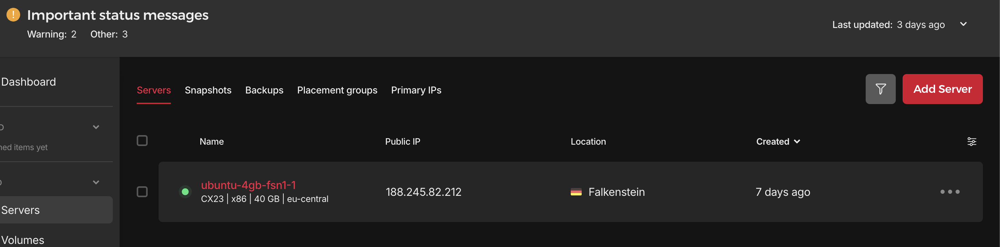
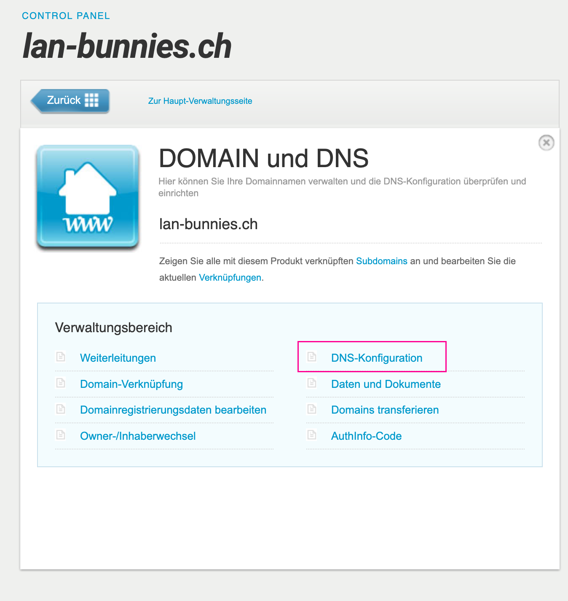
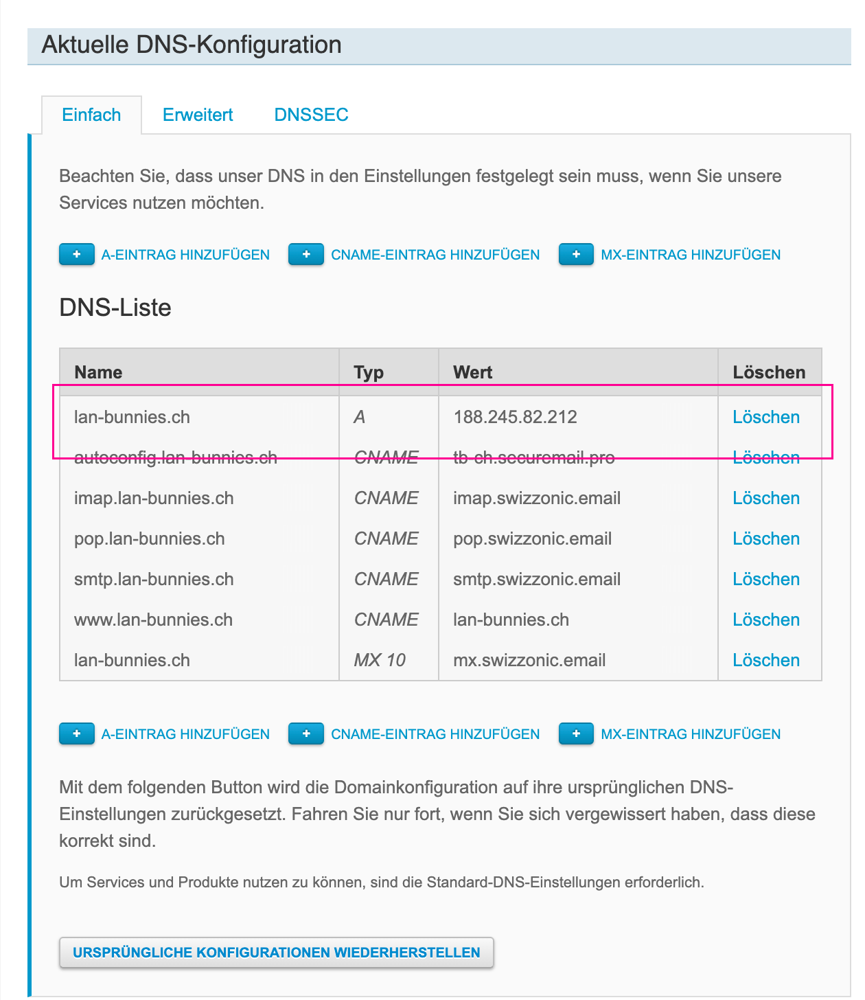
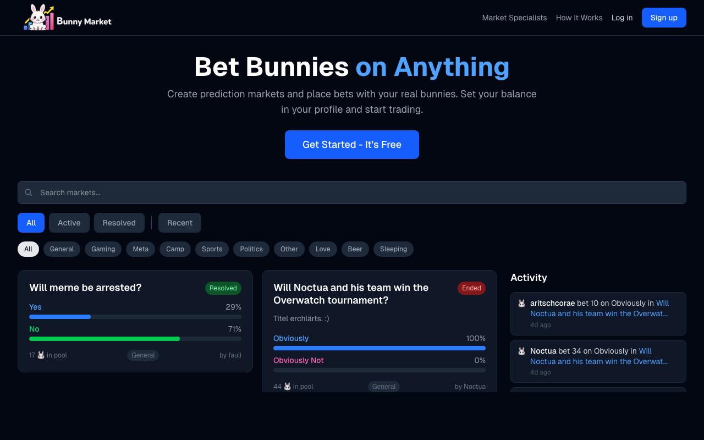
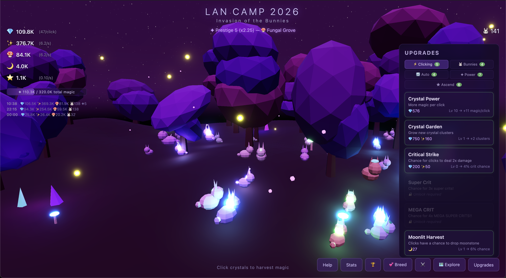

# My workflow creating an app with AI

Date: 10.04.2026

## Steps for app development

1. Create a PLAN.md (or SPEC.md) file using Gemini or a similar Model:
```
For a project I need a PLAN.md file for my claude code setup. For this project I want to create a mobile (at least android) application that I can use to take pictures of my board game cabinet and it inventories the games it finds on the photo automatically. It should check if they are already added to the inventory, and if not, add them. There should be an inventory with added games with the possibility to add a "nice" photo of the games box later on. Otherwise it's just the name. I want to be able to rate the game myself but also have the boargamegeeks rating shown. I should be able to say If I have played the game yet or not. The taken photo should be analyzed using an AI service (maybe ChatGpt, maybe Antropic, whatever you think it best right now).
```
2. Then I use the same AI to create an CLAUDE.md file:
```
create a state of the art CLAUDE.md file for this project.
---- // OPTIONALLY:
create a complete, sound and state of the art ARCHITECTURE.md file for the project.
```
3. Then I copy these into a newly created folder and run:
```
git init
git add --all
git commit -m "feat(project): initial AI setup"
claude
```
4. Then within claude, I run:
```
Analyze the files given in the project folder. 
Come up with a complete and comprehensive TODO.md file we can use to implement the application.
---- // When this is done and I reviewed the proposal:
Let's start with implementing phase 0 (or whatever the first phase is)
```
5. If I want to have mulitple personas/roles. I do something like this:
```
Create slash commands I can use and activate the following personas for the given prompt:
- expert security reviewer
- expert UX Designer
- $Product Enthusiast
- ...
```
You can then do: /expert-security-reviewer check the current project and validate agains OWASP top 10 and currently known CVEs for the technologies we're using.


**Tip:** Use `Shift+Tab` to toggle plan mode — great for thinking through bigger changes before implementing. You'll see "⏸ plan mode on" when it's active.

## Steps for deployment
When I want to deploy my webapp, I get a server on [Hetzner](https://www.hetzner.com) and a domain on [Swizzonic](https://www.swizzonic.ch).

### Hetzner


Sync your SSH keys to the server so the agent can access it easily later.

### Swizzonic





**The DNS sync can take a few hours, so do this as early as possible.**

### Setup

For the setup, I use the same claude session as creating the app, then tell it:
```
Create a Dockerfile to build the application image so I can deploy it as container.
Be aware that the setup is working over multiple deployments, so make any data that is needed permanently stored on an outside volume or database.
---- // When this is done:
You can connect to the server $yourdomain as root.
It's a fresh Ubuntu VM and the SSH keys are already configured.
Install the application there
---- // When this is done:
The application currently is running on HTTP. Use let'sencrypt to setup HTTPS properly
```

## App Created this way

### Game Vault

// TODO

### Screenshot Vault

// TODO

### Bunny market

https://bunny-market.ch/

Repo: https://github.com/Fauli/bunny-market



### Bunny Clicker Game

https://lan-bunnies.ch/

Repo: https://github.com/Fauli/bunny-idle-game


